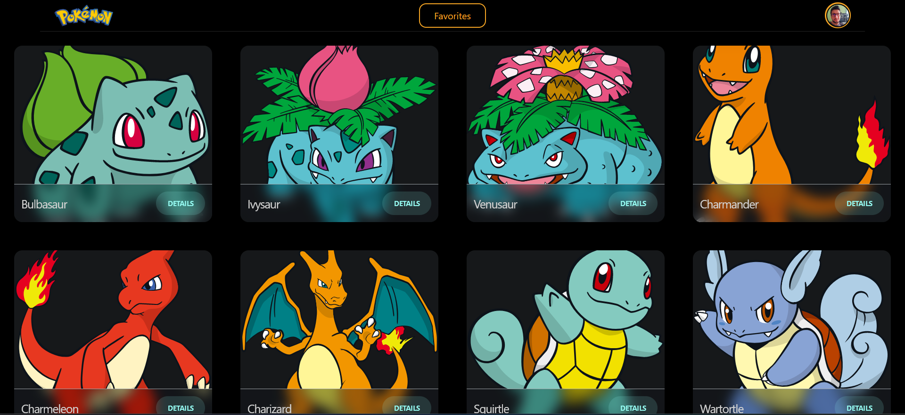
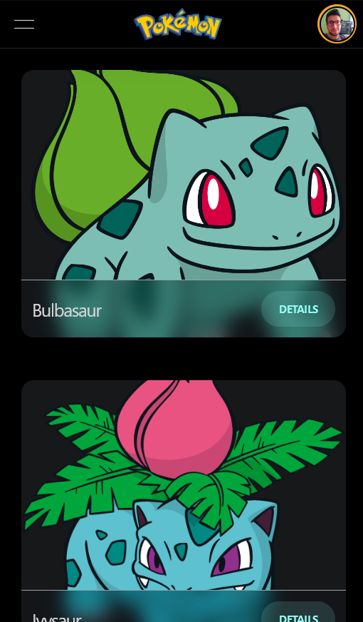
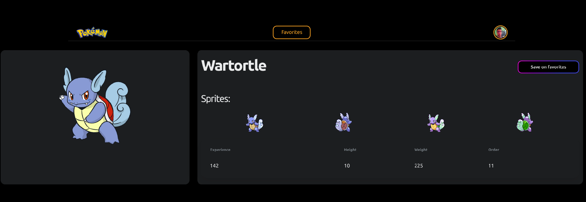
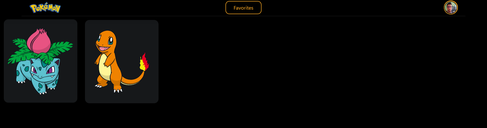
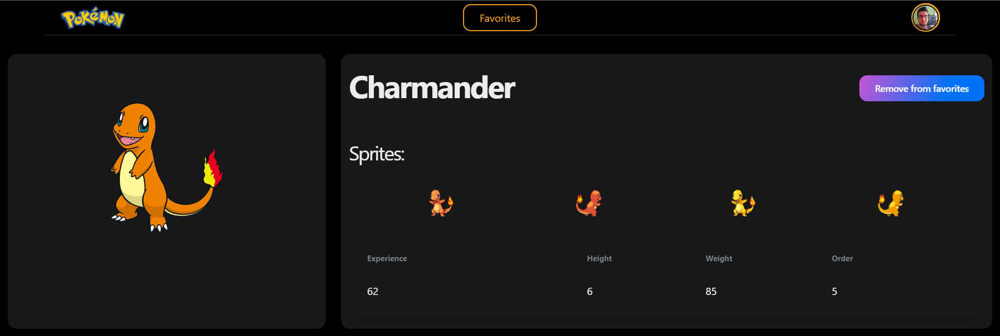

# Next Pokemon App

This repository contains an application created in Next using next and the Pokemon API.

## Installation

Get code using

```
git clone https://github.com/baguilar6174/next-pokemon-app.git
```

Step 2:

Install the necessary libraries (make sure you have node >= 16 and yarn)

```
yarn
```

Step 3:

Runs the app in the development mode

```
yarn dev
```

Open [http://localhost:3000](http://localhost:3000) with your browser to see the result.

## My process

### Build with

- Next JS
- React JS
- Typescript
- Poke API
- Next UI

### What I learned

- Using Layouts
- Using Next UI components
- Flex Layout
- Next UI themes
- Navigation
- URL Params
- Next GetStaticProps & GetStaticPaths
- Generate pages in build time
- Incremental static regeneration

## Next Pokemon App

<table>
  <tr>
    <td align="center" valign="center"></td>
    <td align="center" valign="center"></td>
  </tr>
  <tr>
    <td colspan="2" align="center" valign="center"></td>
  </tr>
  <tr>
    <td colspan="2" align="center" valign="center"></td>
  </tr>
  <tr>
    <td colspan="2" align="center" valign="center"></td>
  </tr>
 </table>

## Stay in touch

- Website - [www.bryan-aguilar.com](https://www.bryan-aguilar.com/)
- Medium - [baguilar6174](https://baguilar6174.medium.com/)
- LinkeIn - [baguilar6174](https://www.linkedin.com/in/baguilar6174)
